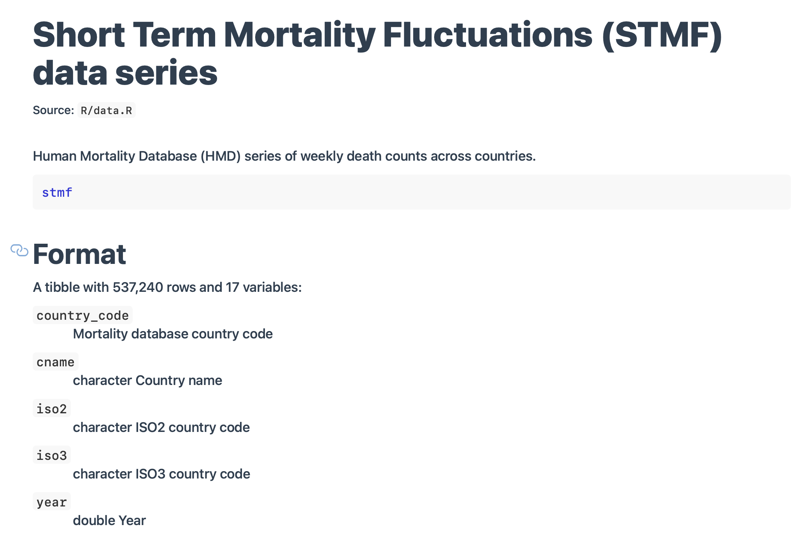
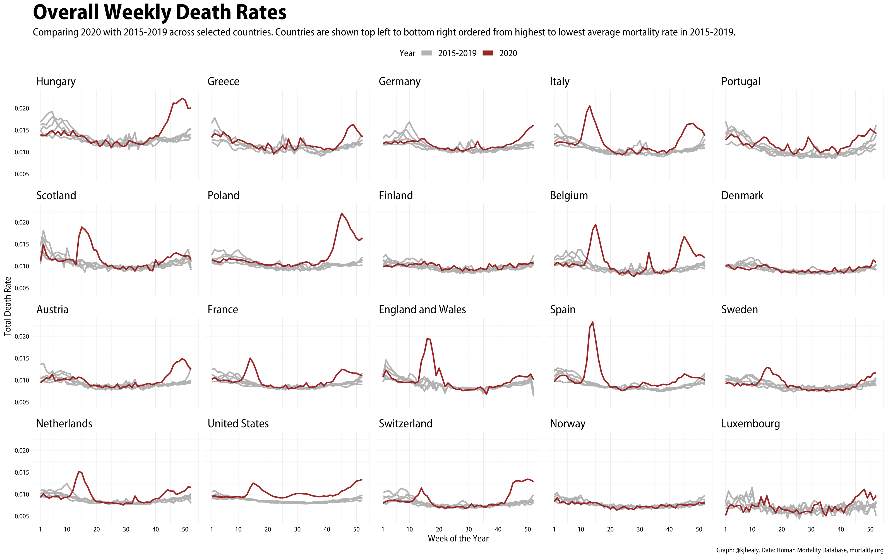
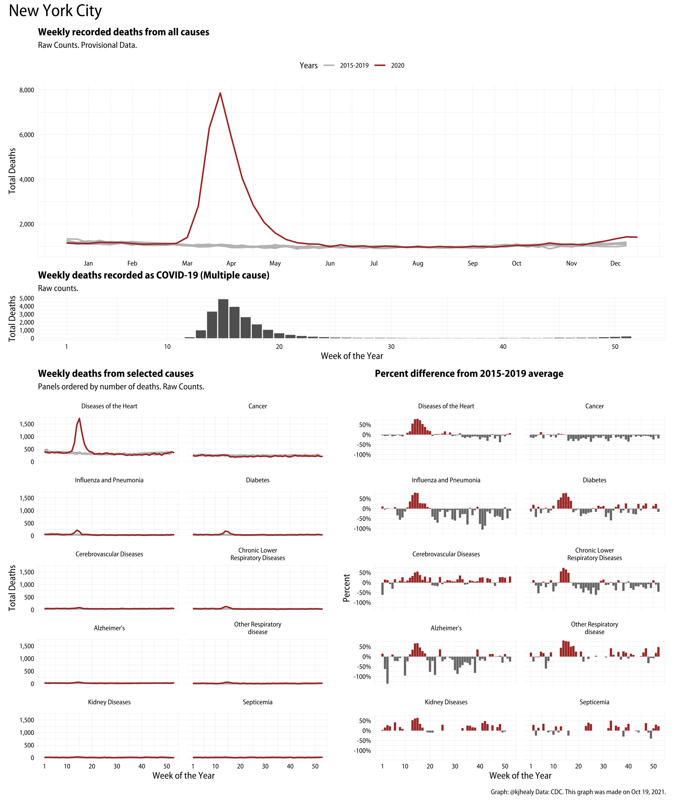

```{r setup, include=FALSE}
knitr::opts_chunk$set(warning = FALSE, message = FALSE, 
                      fig.retina = 3, fig.align = "center", 
                      fig.height = 4, fig.width = 8)
```

```{r packages-data, include=FALSE}
library(flipbookr)
library(cowplot)
ggplot2::theme_set(theme_cowplot())

```

```{r xaringanExtra, echo=FALSE}
xaringanExtra::use_xaringan_extra(c("tile_view"))
xaringanExtra::use_animate_css()
xaringanExtra::use_animate_all("fade")
xaringanExtra::use_clipboard()
```

class: center middle main-title section-title-1

# .kjh-yellow[Faceting] and .kjh-green[Patchwork]  

.class-info[

**STA/ISS 313 Guest Lecture**

.light[Kieran Healy<br>
Duke Sociology, October 20th 2021]

]

---

layout: true
class: title title-1

---

# Setup

```{r, echo = FALSE, include = FALSE, message = FALSE}
###-------------------------------------------------
### Not needed to draw the graphs
library(ggplot2)
library(showtext)
showtext_auto()

library(myriad)
import_myriad_semi_ttf()

theme_set(theme_myriad_new())
###-------------------------------------------------
```

```{r 06-getting-data-in-1, message = FALSE}
library(here)      # manage file paths
library(tidyverse) # your friend and mine

## The astonishingly useful plot composer
library(patchwork)

## Data Visualization book: https://kjhealy.github.io/socviz
## install.packages("socviz") 
library(socviz)    # data and some useful functions

## A COVID data package: https://kjhealy.github.io/covdata
## remotes::install_github("kjhealy/covdata") 
library(covdata) 

## Some penguins
library(palmerpenguins)

```


---

layout: false
class: main-title main-title-inv

# .middle.squish4[.kjh-orange[Informatively Presenting a Lot of Data at Once]]

---

layout: true
class: title title-1

---

# Faceted Penguins

```{r, out.width="75%"}
p <- ggplot(penguins, aes(x = flipper_length_mm, y = body_mass_g)) +
  geom_point()
p + facet_wrap(~species)
```

---

# .kjh-yellow[Reordered] Penguins

```{r, out.width="75%"}
p <- ggplot(penguins, aes(x = flipper_length_mm, y = body_mass_g)) +
  geom_point()
p + facet_wrap(~ reorder(species, body_mass_g))
```


---

# .kjh-yellow[Reordered] Penguins

```{r, out.width="75%"}
p <- ggplot(penguins, aes(x = flipper_length_mm, y = body_mass_g)) +
  geom_point() +
  geom_smooth(se = FALSE, size = 2)
p + facet_wrap(~ reorder(species, body_mass_g))
```

---

# The .kjh-orange[covdata] package

```{r}
library(covdata)
```


.pull-left[]

.pull-right[

-  A data package that collects and bundles datasets related to the COVID-19 pandemic from a variety of sources. 

- Cross-national case and mortality data; data for states and counties in the U.S.; mobility data from Apple; other material.  

]

---

# The .kjh-orange[covdata] package

.pull-left[
  
  ]

.pull-right[
- More information at the package homepage.
- <http://kjhealy.github.io/covdata>
]

---

# Let's take a look

```{r}
stmf
```

---

# Let's take a look


]

---

# What we're interested in 

```{r}
stmf %>%
    filter(sex == "b", year > 2014 & year < 2020) %>% 
    select(cname, iso3, year:sex, age_group, death_rate, rate_total)
```


---

# Mortality rankings: mean and max 

```{r}
rate_rank <- stmf %>%
  filter(sex == "b", year > 2014 & year < 2020) %>%
  group_by(country_code) %>%
  summarize(mean_rate = mean(rate_total, na.rm = TRUE)) %>%
  mutate(rate_rank = rank(mean_rate))


rate_max_rank <- stmf %>%
  filter(sex == "b", year == 2020) %>%
  group_by(country_code) %>%
  summarize(covid_max = max(rate_total, na.rm = TRUE)) %>%
  mutate(covid_max_rank = rank(covid_max))

```

---

# Mortality rankings: mean and max 

.pull-left[
```{r}
rate_rank
```
]

.pull-right[
```{r}
rate_max_rank
```
]

---

# Select the columns; merge the ranks

.SMALL[
```{r}
df <- stmf %>%
  filter(sex == "b", year > 2014, year < 2021,
         country_code %in% c("AUT", "BEL", "CHE", "DEUTNP", "DNK", "ESP", "FIN", "FRATNP", "GBR_SCO", "GBRTENW",
                             "GRC", "HUN", "ITA", "LUX", "POL", "NLD", "NOR", "PRT", "SWE", "USA")) %>%
  filter(!(year == 2020 & week > 53)) %>%
  group_by(cname, year, week) %>%
  mutate(yr_ind = year %in% 2020) %>%
  slice(1) %>%
  left_join(rate_rank, by = "country_code") %>%
  left_join(rate_max_rank, by = "country_code")

df
```
]

---

# And make a plot

```{r}
p_out <- df %>% 
  ggplot(aes(x = week, y = rate_total, color = yr_ind, group = year)) +
  scale_color_manual(values = c("gray70", "firebrick"), labels = c("2015-2019", "2020")) +
  scale_x_continuous(limits = c(1, 52),
                     breaks = c(1, seq(10, 50, 10)),
                     labels = as.character(c(1, seq(10, 50, 10)))) +
  facet_wrap(~ cname, ncol = 10) +
  geom_line(size = 0.9) +
  labs(x = "Week of the Year", y = "Total Death Rate",
       color = "Year", title = "Overall Weekly Death Rates",
       caption = "Graph: @kjhealy. Data: Human Mortality Database, mortality.org")
```

---

# And make a plot

```{r, fig.height=8, fig.width=20}
p_out
```

---

# .kjh-pink[Reorder] the facets

```{r}
p_out <- df %>% 
  ggplot(aes(x = week, y = rate_total, color = yr_ind, group = year)) +
  scale_color_manual(values = c("gray70", "firebrick"), labels = c("2015-2019", "2020")) +
  scale_x_continuous(limits = c(1, 52),
                     breaks = c(1, seq(10, 50, 10)),
                     labels = as.character(c(1, seq(10, 50, 10)))) +
  geom_line(size = 0.9) +
  facet_wrap(~ reorder(cname, rate_rank, na.rm = TRUE), ncol = 10) + #<<
  labs(x = "Week of the Year", y = "Total Death Rate",
       color = "Year", title = "Overall Weekly Death Rates",
       caption = "Graph: @kjhealy. Data: Human Mortality Database, mortality.org")
```

---

# .kjh-pink[Reorder] the facets

```{r, fig.height=8, fig.width=20}
p_out
```

---

layout: false
class: main-title main-title-inv



---

layout: true
class: title title-1

---

# .kjh-green[Patchwork]

```{r}
p1 <- ggplot(mpg) + 
  geom_point(aes(x = displ, y = hwy))

p2 <- ggplot(mpg) + 
  geom_bar(aes(x = as.character(year), fill = drv), position = "dodge") + 
  labs(x = "year")

p3 <- ggplot(mpg) + 
  geom_density(aes(x = hwy, fill = drv), colour = NA) + 
  facet_grid(rows = vars(drv))

p4 <- ggplot(mpg) + 
  stat_summary(aes(x = drv, y = hwy, fill = drv), geom = "col", fun.data = mean_se) +
  stat_summary(aes(x = drv, y = hwy), geom = "errorbar", fun.data = mean_se, width = 0.5)
```

---

# Patchwork

```{r}
p1 + p2 + p3 + guide_area() + plot_layout(ncol = 2, guides = "collect")
```

---

# US .kjh-yellow[COVID Mortality] in 2020

```{r}
nchs_wdc
```

---

# US .kjh-yellow[COVID Mortality] in 2020

```{r}
start_week <- 1
end_week <- 53

states <- nchs_wdc %>%
  select(jurisdiction) %>%
  unique()

states
```

---


# US .kjh-yellow[COVID Mortality] in 2020


```{r}
dat <- nchs_wdc %>%
  filter(year > 2014, year < 2021) %>%
  mutate(month_label = lubridate::month(week_ending_date, label = TRUE))

dat

```

---

# US .kjh-yellow[COVID Mortality] in 2020


```{r}
average_deaths <- nchs_wdc %>%
  filter(year %in% c(2015:2019)) %>%
  group_by(jurisdiction, week, cause) %>%
  summarize(average_wk_deaths = mean(n, na.rm = TRUE))

average_deaths
```

---

# US .kjh-yellow[COVID Mortality] in 2020


```{r}
df <- left_join(dat, average_deaths) %>%
  select(everything(), n, average_wk_deaths) %>%
  mutate(n_diff = n - average_wk_deaths,
         pct_diff = (n_diff / n)*100) %>%
  filter(cause %nin% c("Natural Causes", "Other"))

df
```

---

# Getting set up

```{r}
nwks <- 53

season_label <- tibble(wk_num = lubridate::epiweek(as.Date(c("2020-03-01",
                                                             "2020-06-01",
                                                             "2020-09-01",
                                                             "2020-12-01"))),
                       season_lab = c("Spring", "Summer", "Autumn", "Winter"))

season_label
```

---

# Getting set up

```{r}
month_label <- tibble(wk_num = lubridate::epiweek(lubridate::ymd("2020-01-15") + months(0:11)),
                      month_lab = as.character(lubridate::month(lubridate::ymd("2020-01-15") +
                                                                  months(0:11), label = TRUE)))

month_label
```

```{r, include = FALSE}
order_panels <- function(st = state, ...) {
  df %>%
    filter(year < 2021,
           jurisdiction %in% st, cause != "All Cause") %>%
    group_by(cause) %>%
    summarize(deaths = sum(n, na.rm = TRUE),
              .groups = "drop") %>%
    mutate(cause_rank = rank(-deaths),
           o = order(cause_rank),
           cause_ord = factor(cause, levels = cause[o], ordered = TRUE)) %>%
    select(cause, cause_ord)
}

```

---

# Panel 1

```{r}
out <- df %>%
    filter(year < 2021, jurisdiction %in% "New York City", cause == "All Cause") %>%
    group_by(year, week) %>%
    mutate(yr_ind = year %in% 2020) %>%
    filter(!(year == 2020 & week > nwks)) %>%
    ggplot(aes(x = week, y = n, color = yr_ind, group = year)) +
    geom_line(size = 0.9) +
    scale_color_manual(values = c("gray70", "firebrick"), labels = c("2015-2019", "2020")) +
    scale_x_continuous(breaks = month_label$wk_num, labels = month_label$month_lab) +
    scale_y_continuous(labels = scales::comma) +
    labs(x = NULL,
         y = "Total Deaths",
         color = "Years",
         title = "Weekly recorded deaths from all causes",
         subtitle = "Raw Counts. Provisional Data.")
```

---

# Panel 1

```{r, fig.width=6, fig.height=4, out.width="60%"}
out
```

---

# Panel 2

```{r}
  out <- df %>%
    filter(year < 2021) %>%
    filter(jurisdiction %in% "North Carolina", cause %in% c("COVID-19 Multiple cause")) %>%
    group_by(year, week) %>%
    mutate(yr_ind = year %in% 2020) %>%
    filter(year == 2020) %>%
    ggplot(aes(x = week, y = n, group = year)) +
    geom_col(fill = "gray30") +
    scale_x_continuous(breaks = c(1, 10, 20, 30, 40, 50),
                       labels = as.character(c(1, 10, 20, 30, 40, 50)),
                       limits = c(1, 52)) +
    scale_y_continuous(labels = scales::comma) +
    labs(x = "Week of the Year",
         y = "Total Deaths",
         color = "Years",
         subtitle = "Raw counts.",
         title = "Weekly deaths recorded as COVID-19 (Multiple cause)")

```

---

# Panel 2

```{r, fig.width=10, fig.height=4, out.width="90%"}
out
```

---

# Panel 3

```{r}
panel_ordering <- order_panels(st = "California")

out <- df %>%
    filter(year < 2021,
           jurisdiction == "California",
           cause %nin% c("All Cause", "COVID-19 Multiple cause", "COVID-19 Underlying")) %>%
    group_by(cause, year, week) %>%
    summarize(deaths = sum(n, na.rm = TRUE), .groups = "drop") %>%
    mutate(yr_ind = year %in% 2020) %>%
    filter(!(year == 2020 & week > nwks)) %>%
    left_join(panel_ordering, by = "cause") %>%
    ggplot(aes(x = week, y = deaths, color = yr_ind)) +
    geom_line(size = 0.9, mapping = aes(group = year)) +
    scale_color_manual(values = c("gray70", "firebrick"), labels = c("2015-2019", "2020")) +
    scale_x_continuous(breaks = c(1, 10, 20, 30, 40, 50), labels = as.character(c(1, 10, 20, 30, 40, 50))) +
    scale_y_continuous(labels = scales::comma) +
    facet_wrap(~ cause_ord, ncol = 2, labeller = label_wrap_gen(25)) +
    labs(x = "Week of the Year",
         y = "Total Deaths",
         color = "Years",
         title = "Weekly deaths from selected causes",
         subtitle = "Panels ordered by number of deaths. Raw Counts.")
```

---

# Panel 3

```{r, fig.width=6, fig.height=8, out.width="40%"}
out
```


# Panel 4

```{r}
panel_ordering <- order_panels(st = "North Carolina")

out <- df %>%
    filter(year < 2021) %>%
    filter(jurisdiction %in% "North Carolina",
           year == 2020,
           cause %nin% c("All Cause", "COVID-19 Multiple cause",
                         "COVID-19 Underlying"), !is.na(pct_diff)) %>%
    group_by(week) %>%
    filter(!(week > nwks)) %>%
    mutate(ov_un = pct_diff > 0) %>%
    left_join(panel_ordering, by = "cause") %>%
    ggplot(aes(x = week, y = pct_diff/100, fill = ov_un)) +
    geom_col() +
    scale_x_continuous(breaks = c(1, seq(10, nwks, 10)), labels = as.character(c(1, seq(10, nwks, 10)))) +
    scale_y_continuous(labels = scales::percent) +
    scale_fill_manual(values = c("gray40", "firebrick")) +
    guides(fill = "none") +
    facet_wrap(~ cause_ord, ncol = 2, labeller = label_wrap_gen(25)) +
    labs(x = "Week of the Year",
         y = "Percent",
         title = "Percent difference from 2015-2019 average")
```

---

# Panel 4

```{r, fig.width=6, fig.height=8, out.width="40%"}
out
```

---

# Now the .kjh-green[fun()] part

```{r}
patch_state_count <- function(state) {

  out <- df %>%
    filter(year < 2021, jurisdiction %in% state, cause == "All Cause") %>%
    group_by(year, week) %>%
    mutate(yr_ind = year %in% 2020) %>%
    filter(!(year == 2020 & week > nwks)) %>%
    ggplot(aes(x = week, y = n, color = yr_ind, group = year)) +
    geom_line(size = 0.9) +
    scale_color_manual(values = c("gray70", "firebrick"), labels = c("2015-2019", "2020")) +
    scale_x_continuous(breaks = month_label$wk_num, labels = month_label$month_lab) +
    scale_y_continuous(labels = scales::comma) +
    labs(x = NULL,
         y = "Total Deaths",
         color = "Years",
         title = "Weekly recorded deaths from all causes",
         subtitle = "Raw Counts. Provisional Data.")

  out

}

```

---

# Wrap each plot as a function that creates it

```{r}
patch_state_covid <- function(state) {

  out <- df %>%
    filter(year < 2021) %>%
    filter(jurisdiction %in% state, cause %in% c("COVID-19 Multiple cause")) %>%
    group_by(year, week) %>%
    mutate(yr_ind = year %in% 2020) %>%
    filter(year == 2020) %>%
    ggplot(aes(x = week, y = n, group = year)) +
    geom_col(fill = "gray30") +
    scale_x_continuous(breaks = c(1, 10, 20, 30, 40, 50),
                       labels = as.character(c(1, 10, 20, 30, 40, 50)),
                       limits = c(1, 52)) +
    scale_y_continuous(labels = scales::comma) +
    labs(x = "Week of the Year",
         y = "Total Deaths",
         color = "Years",
         subtitle = "Raw counts.",
         title = "Weekly deaths recorded as COVID-19 (Multiple cause)")

  out

}

```

---


# Wrap each plot as a function that creates it

```{r}
patch_state_cause <- function(state, nc = 2) {

  panel_ordering <- order_panels(st = state)

  out <- df %>%
    filter(year < 2021,
           jurisdiction == state,
           cause %nin% c("All Cause", "COVID-19 Multiple cause", "COVID-19 Underlying")) %>%
    group_by(cause, year, week) %>%
    summarize(deaths = sum(n, na.rm = TRUE), .groups = "drop") %>%
    mutate(yr_ind = year %in% 2020) %>%
    filter(!(year == 2020 & week > nwks)) %>%
    left_join(panel_ordering, by = "cause") %>%
    ggplot(aes(x = week, y = deaths, color = yr_ind)) +
    geom_line(size = 0.9, mapping = aes(group = year)) +
    scale_color_manual(values = c("gray70", "firebrick"), labels = c("2015-2019", "2020")) +
    scale_x_continuous(breaks = c(1, 10, 20, 30, 40, 50), labels = as.character(c(1, 10, 20, 30, 40, 50))) +
    scale_y_continuous(labels = scales::comma) +
    facet_wrap(~ cause_ord, ncol = nc, labeller = label_wrap_gen(25)) +
    labs(x = "Week of the Year",
         y = "Total Deaths",
         color = "Years",
         title = "Weekly deaths from selected causes",
         subtitle = "Panels ordered by number of deaths. Raw Counts.")

  out
}

```

---


# Wrap each plot as a function that creates it


```{r}
patch_state_percent <- function(state, nc = 2){

  panel_ordering <- order_panels(st = state)

  out <- df %>%
    filter(year < 2021) %>%
    filter(jurisdiction %in% state,
           year == 2020,
           cause %nin% c("All Cause", "COVID-19 Multiple cause",
                         "COVID-19 Underlying"), !is.na(pct_diff)) %>%
    group_by(week) %>%
    filter(!(week > nwks)) %>%
    mutate(ov_un = pct_diff > 0) %>%
    left_join(panel_ordering, by = "cause") %>%
    ggplot(aes(x = week, y = pct_diff/100, fill = ov_un)) +
    geom_col() +
    scale_x_continuous(breaks = c(1, seq(10, nwks, 10)), labels = as.character(c(1, seq(10, nwks, 10)))) +
    scale_y_continuous(labels = scales::percent) +
    scale_fill_manual(values = c("gray40", "firebrick")) +
    guides(fill = "none") +
    facet_wrap(~ cause_ord, ncol = nc, labeller = label_wrap_gen(25)) +
    labs(x = "Week of the Year",
         y = "Percent",
         title = "Percent difference from 2015-2019 average")

  out
}

```

# Now wrap those up, too 

```{r}
make_patchplot <- function(state){

  if(state == "New York")  {
    state_title <- paste(state, "(Excluding New York City)")
  } else
  {
    state_title <- state
  }

  timestamp <-  lubridate::stamp("March 1, 1999", "%B %d, %Y")(lubridate::ymd(Sys.Date()))


  (patch_state_count(state) + theme(plot.margin = unit(c(5,0,0,0), "pt"))) /
    patch_state_covid(state) /
    (patch_state_cause(state) + (patch_state_percent(state))) +
    plot_layout(heights = c(2, 0.5, 4), guides = 'collect') +
    plot_annotation(
      title = state_title,
      caption = paste0("Graph: @kjhealy Data: CDC. This graph was made on ", timestamp, "."),
      theme = theme(plot.title = element_text(size = rel(2), hjust = 0, face = "plain")))
}

```

---

# Now we can do this

```{r}
p_out <- make_patchplot("New York City")
```

---

layout: false
class: main-title main-title-inv



---


---

layout: true
class: title title-1

---

# But we're not done yet!

```{r}

states <- states %>%
  mutate(fname = paste0(here::here("figures", tolower(jurisdiction)), "_patch"),
         fname = stringr::str_replace_all(fname, " ", "_"))

states
```

---

# .kjh-yellow[Map] the function to the jurisdictions

```{r, warning=FALSE}
out_patch <- states %>%
  mutate(patch_plot = map(jurisdiction, make_patchplot))

out_patch

```

---

# .kjh-yellow[Map] the function to the jurisdictions

```{r, warning=FALSE}
out_patch %>% 
  filter(jurisdiction == "North Carolina") %>% 
  pull(patch_plot)

```

---

# Walk out the results to a folder

```{r, eval = FALSE, echo = TRUE}
## Be patient
walk2(paste0(out_patch$fname, ".png"),
      out_patch$patch_plot, ggsave, height = 16, width = 9, dpi = 200)

```

---

# Et voila

```{r, eval = FALSE, echo = FALSE}
fs::dir_tree("figures")
```

``` r
fs::dir_tree("figures")

figures
├── alabama_patch.png
├── alaska_patch.png
├── arizona_patch.png
├── arkansas_patch.png
├── california_patch.png
├── colorado_patch.png
├── connecticut_patch.png
├── delaware_patch.png
├── district_of_columbia_patch.png
├── florida_patch.png
├── georgia_patch.png
├── hawaii_patch.png
├── idaho_patch.png
├── illinois_patch.png

```

