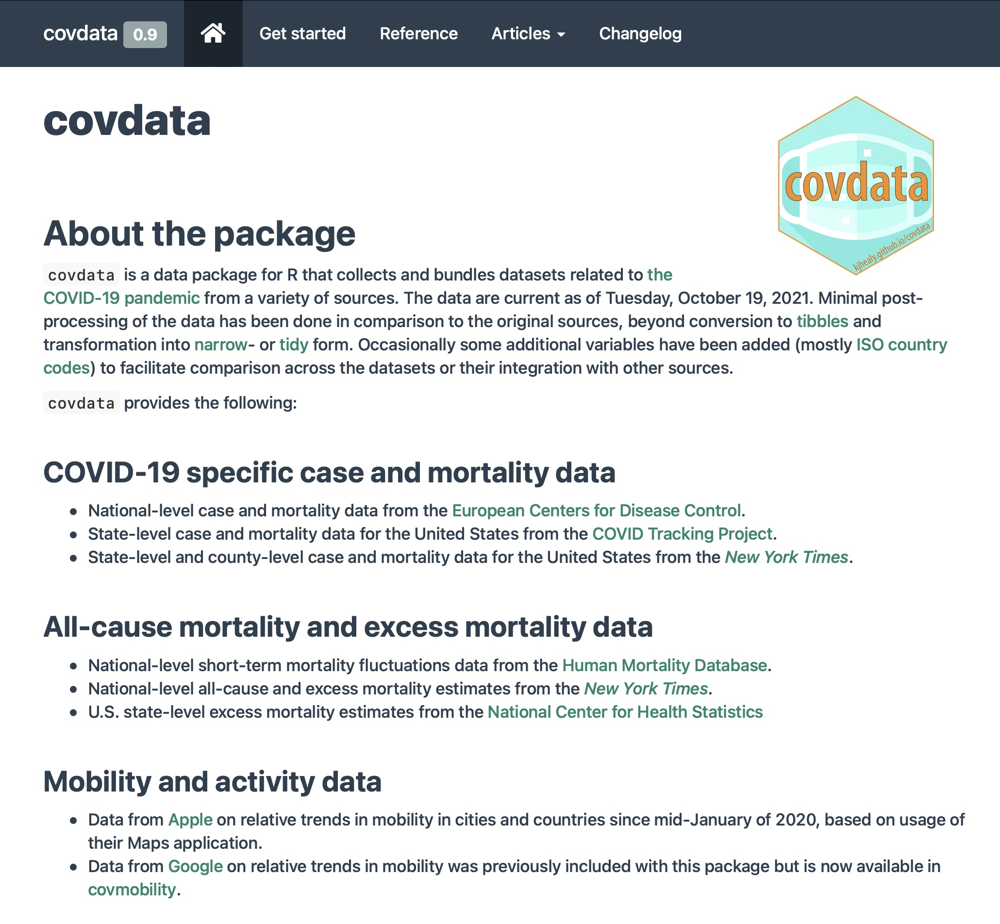

```{r setup, include=FALSE}
knitr::opts_chunk$set(warning = FALSE, message = FALSE, 
                      fig.retina = 3, fig.align = "center", 
                      fig.height = 4, fig.width = 8)
```

```{r packages-data, include=FALSE}
library(flipbookr)
library(cowplot)
ggplot2::theme_set(theme_cowplot())

```

```{r xaringanExtra, echo=FALSE}
xaringanExtra::use_xaringan_extra(c("tile_view"))
xaringanExtra::use_animate_css()
xaringanExtra::use_animate_all("fade")
xaringanExtra::use_clipboard()
```

class: center middle main-title section-title-1

# .kjh-yellow[Faceting] and .kjh-green[Patchworking]  

.class-info[

**STA/ISS 313 Guest Lecture**

.light[Kieran Healy<br>
Duke Sociology, October 20th 2021]

]

---

layout: true
class: title title-1

---

# Setup

```{r, echo = FALSE, include = FALSE, message = FALSE}
###-------------------------------------------------
### Not needed to draw the graphs
library(ggplot2)
library(showtext)
showtext_auto()

library(myriad)
import_myriad_semi_ttf()

theme_set(theme_myriad_new())
###-------------------------------------------------
```

```{r 06-getting-data-in-1, message = FALSE}
library(here)      # manage file paths
library(tidyverse) # your friend and mine

## The astonishingly useful plot composer
library(patchwork)

## Data Visualization book: https://kjhealy.github.io/socviz
## install.packages("socviz") 
library(socviz)    # data and some useful functions

## A COVID data package: https://kjhealy.github.io/covdata
## remotes::install_github("kjhealy/covdata") 
library(covdata) 

## Some demographic data: https://kjhealy.github.io/demog
## remotes::install_github("kjhealy/demog") 
library(demog) 


## Some penguins
library(palmerpenguins)

```


---

layout: false
class: main-title main-title-inv

# .middle.squish4[.kjh-orange[We've put a lot of pieces in place at this point]]

---

layout: true
class: title title-1

---

# Faceted Penguins

```{r, out.width="75%"}
p <- ggplot(penguins, aes(x = flipper_length_mm, y = body_mass_g)) +
  geom_point()
p + facet_wrap(~species)
```

---

# .kjh-yellow[Reordered] Penguins

```{r, out.width="75%"}
p <- ggplot(penguins, aes(x = flipper_length_mm, y = body_mass_g)) +
  geom_point()
p + facet_wrap(~ reorder(species, body_mass_g))
```


---

# .kjh-yellow[Reordered] Penguins

```{r, out.width="75%"}
p <- ggplot(penguins, aes(x = flipper_length_mm, y = body_mass_g)) +
  geom_point() +
  geom_smooth(se = FALSE, size = 2)
p + facet_wrap(~ reorder(species, body_mass_g))
```

---

# The .kjh-orange[covdata] package

```{r}
library(covdata)
```


.pull-left[]

.pull-right[

-  A data package that collects and bundles datasets related to the COVID-19 pandemic from a variety of sources. 

- Cross-national case and mortality data; data for states and counties in the U.S.; mobility data from Apple; other material.  

]

---

# The .kjh-orange[covdata] package

.pull-left[
  
  ]

.pull-right[
- More information at the package homepage.
- <http://kjhealy.github.io/covdata>
]

---

# Let's take a look

```{r}
stmf
```

---

# Let's take a look


]

---


